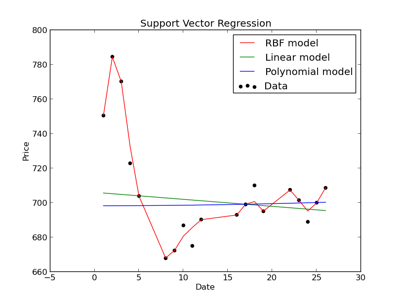

# Stock Price Prediction using Regression
Predicting Google’s stock price using various regression techniques. Toy example for learning how to combine numpy, scikit-learn and matplotlib. Can be extended to be more advanced.

Based on [this](http://beancoder.com/linear-regression-stock-prediction/) tutorial.
